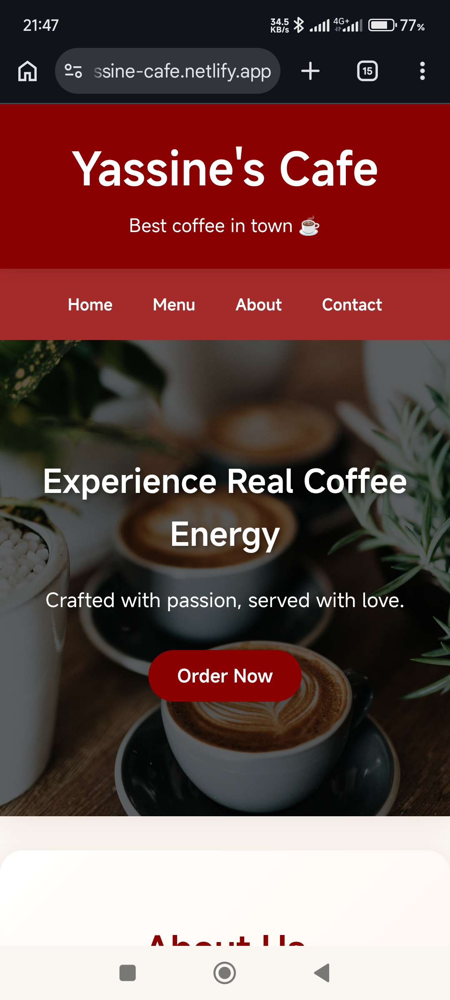

# ☕ Yassine's Café Website

A **modern, fully responsive café website** designed and developed by **Yassine Nghima**.  
Perfect for cafés, coffee shops, or small restaurants that want a warm and engaging online presence.

## 🚀 Live Demo
[Check it out here!](https://yassine-cafe.netlify.app/)

## 🌟 Features
- Fully responsive design for **mobile & desktop**
- Smooth scrolling navigation for a seamless experience
- Interactive menu & gallery sections
- Contact form integration
- Clean and modern UI with cozy vibes

## 🛠 Technologies
- HTML5  
- CSS3 (Flexbox & Grid)  
- JavaScript (vanilla)  
- Deployed on **Netlify**

## 📸 Screenshot
  

## 👨‍💻 Author
**Yassine Nghima**  
Web Developer & Designer
